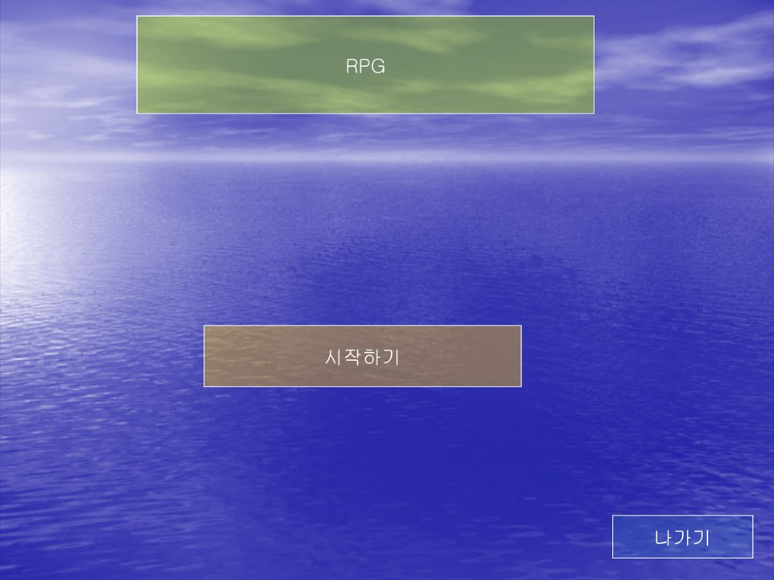
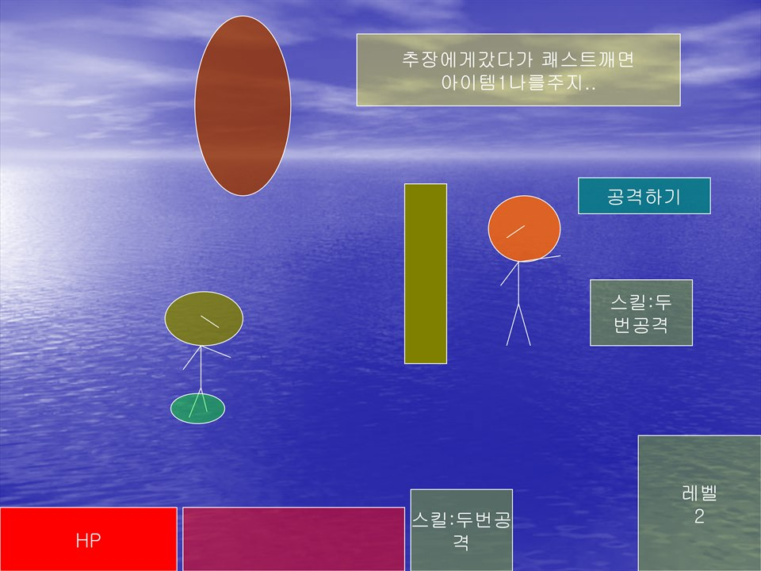

# 파워포인트RPG

파워포인트로 만든 RPG다. 하이퍼링크와 슬라이드 전환으로 체력바와 레벨업, 스킬, 퀘스트를 주는 NPC까지 구현했다.

  
  

## 플레이 방법

Releases에서 받아 실행하면 슬라이드쇼로 바로 시작한다. 파워포인트나 파워포인트 뷰어가 설치되어 있어야 한다. `source/powerpoint-rpg.ppt` 를 열어 F5를 눌러도 된다.

조작은 전부 마우스다. 화면에 나오는 버튼이나 도형을 클릭하면 다음으로 넘어간다.

## 파일

| 경로 | 내용 |
|---|---|
| `source/powerpoint-rpg.ppt` | 원본 프로젝트 파일 |
| `docs/screenshots/` | 스크린샷 |
| Releases | 배포용 파일 |

## 라이선스

CC BY-NC-ND 4.0 라이선스다. 출처를 밝히면 비상업 용도로 그대로 공유할 수 있고, 수정본 배포와 상업적 이용은 금지한다. 함께 들어 있는 것 중 다른 사람이 만든 라이브러리와 그림·소리·맵은 각자의 권리를 따른다. 자세한 내용은 [LICENSE](LICENSE) 에 있다.
